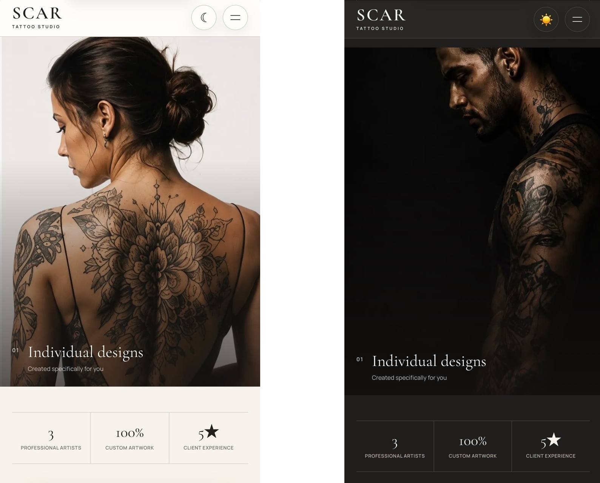
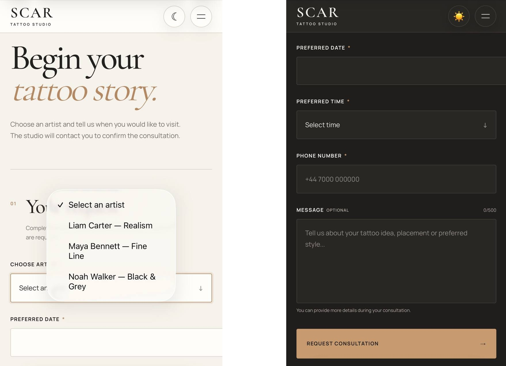
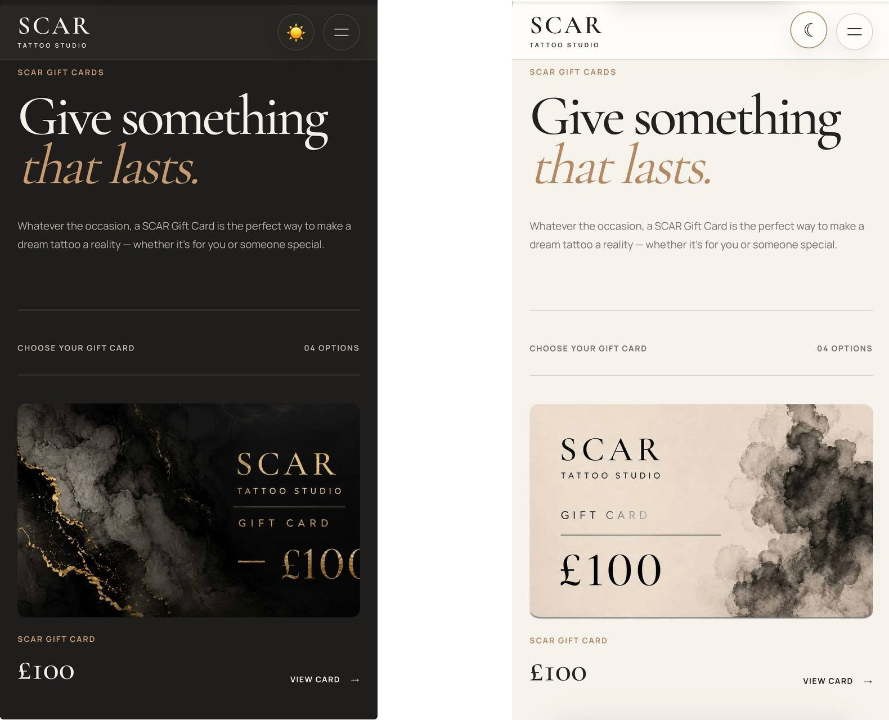

# 🖤 SCAR Tattoo Studio

### Home Page

A modern, fully responsive tattoo studio web application built with **Next.js**, **TypeScript**, **Supabase**, and **Vercel**.

SCAR Tattoo Studio combines a premium editorial design with artist portfolios, consultation booking, client accounts, reviews, gallery management, and a protected admin dashboard.

## 🌐 Live Demo

👉 **https://scar-tattoo-studio.vercel.app/**

### Booking Page

### Gift Cards

## ✨ Features

- 🎨 Premium editorial design
- 🌗 Light and dark theme
- 📱 Fully responsive mobile-first layout
- 🧑‍🎨 Tattoo artist profiles and portfolios
- 🖼️ Public gallery with Supabase Storage
- 📅 Consultation booking system
- 👤 User authentication and profile management
- 📖 Personal My Bookings dashboard
- 🔎 Booking filters for all, upcoming, past, and cancelled bookings
- ⭐ Artist ratings and client reviews
- 🛡️ Review moderation
- 🎁 Gift Cards section
- 🧰 Protected admin dashboard
- 📅 Admin booking management
- 🧑‍🎨 Artist management
- 🖼️ Gallery image upload and deletion
- 👥 User and admin role management
- 📲 Telegram notifications for new consultation requests

## 🛠 Tech Stack

- Next.js
- React
- TypeScript
- CSS Modules
- Supabase
- PostgreSQL
- Supabase Authentication
- Supabase Storage
- Row Level Security
- TanStack Query
- React Hook Form
- Zod
- react-hot-toast
- Telegram Bot API
- Vercel

## 💡 What I Built

During this project I worked on:

- Building a full-stack application with Next.js and TypeScript
- Creating a premium responsive UI from scratch
- Implementing light and dark themes
- Building user authentication and protected routes
- Creating role-based access for clients and administrators
- Building a complete consultation booking flow
- Creating a personal booking dashboard with status filtering
- Building an admin system for managing bookings
- Integrating Telegram notifications for new consultations
- Creating artist profiles and individual portfolios
- Building a public tattoo gallery
- Managing image uploads with Supabase Storage
- Implementing artist ratings and client reviews
- Creating a review moderation workflow
- Building admin tools for artists, gallery, reviews, bookings, and users
- Working with Supabase Row Level Security
- Improving accessibility and responsive user experience
- Deploying the application with Vercel

## 🔐 Authentication & Admin

The application includes separate client and administrator experiences.

Clients can create accounts, manage their profiles, request consultations, track their bookings, and leave reviews.

Administrators have access to a protected dashboard where they can manage bookings, artists, gallery images, reviews, and user roles.

## 📲 Telegram Integration

When a client submits a new consultation request, the booking is stored in Supabase and the studio automatically receives a Telegram notification.

Telegram credentials are handled server-side and are not exposed to the client.

## 📁 Repository

👉 https://github.com/JenyaLinx/scar-tattoo-studio

---

## 👨‍💻 Author

**Yevhenii Oliinyk**

GitHub: https://github.com/JenyaLinx

LinkedIn: https://www.linkedin.com/in/yevhenii-oliinykk
